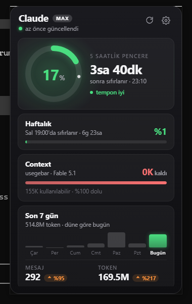

# UsageTray

[Türkçe](README.tr.md) · **English**

A small Windows system tray app that shows your Claude Code usage limits.
The Windows counterpart of Usagebar on macOS.

<p align="center">
  
</p>

- **Tray icon:** a colour-coded ring (green / yellow / orange / red) filled to the 5-hour window's utilisation. The tooltip shows both windows.
- **Popup:** ring gauge for the 5-hour window with a live countdown and a pace verdict; weekly limit; remaining context (with project and model); a 7-day daily token chart with up/down change badges versus yesterday.
- **Pace marker:** the small tick on each bar and on the ring shows how much of the window has elapsed. If the fill is left of the tick, you are fine.
- **Notifications:** 5-hour window at 50% / 75% / 90%, weekly at 80% / 95%, and when remaining context drops under 20K. Each threshold fires once per window.
- Starts with Windows, runs in the background. About 35 MB RAM idle, ~0 CPU, 2.5 MB installer.
- Turkish and English. Follows the system language by default; switchable in settings. The tray menu, tooltip and toasts use the same language.

## Install

1. Download `UsageTray_x.y.z_x64-setup.exe` from Releases and run it. Per-user install, no admin rights needed.
2. You must have run `claude` in a terminal and signed in at least once. UsageTray reads Claude Code's own session; it never asks you to sign in.
3. If the WebView2 runtime is missing it is downloaded during setup. Windows 11 already has it.

> **Windows 11 note:** new tray icons are hidden in the overflow menu (`^`) by default. Drag the icon onto the taskbar to keep it visible, or enable it under Settings → Personalization → Taskbar → Other system tray icons.

Left click opens the popup; it closes on focus loss or Esc. Right click: Refresh / Settings / Start with Windows / Quit.

## Security and privacy

Being suspicious of an app that reads your OAuth token is the right instinct. So:

- The token is sent only to `https://api.anthropic.com/api/oauth/usage`. There is no other network request; the CSP restricts `connect-src` to that host.
- `~/.claude/.credentials.json` is opened **read-only**. The app never refreshes the token or writes to the file; Claude Code does the refreshing.
- The token never appears in a log line; it is masked as `sk-ant-oat01-****`.
- No telemetry, analytics or crash reporting.
- Everything stays local under `%APPDATA%\UsageTray\` (settings, cache, scan state, notification state, logs).

The code is small and readable; if in doubt, look at `src-tauri/src/usage_api.rs` and `credentials.rs`.

## Data sources

| Data | Source |
|---|---|
| 5-hour / weekly limits | Anthropic's OAuth usage endpoint. Not official, community-discovered; if the schema changes the app falls back to its cache instead of crashing. |
| Remaining context, daily tokens / messages, 7-day history | `~/.claude/projects/**/*.jsonl` transcripts. Read incrementally with a byte offset per file; deduped on `message.id + requestId`. |
| Plan badge | `subscriptionType` from `.credentials.json` |

The API is polled at most every 5 minutes. The interval can be raised in settings but never goes below 180 seconds. On a 429 the app backs off exponentially (5 → 10 → 20 → 30 min) and keeps showing the last known data marked as stale.

Context is computed as `input + cache_read + cache_creation + output` of the latest assistant message; the default usable context is 155K (autocompact share excluded) and can be changed in settings. Raise it for 1M-context models.

## States

| What the popup says | Meaning |
|---|---|
| Claude Code not found | No credential file. Run `claude` in a terminal and sign in. |
| Token expired | Access tokens last about an hour and are only refreshed while Claude Code is running. Running `claude` once is enough; this is not an error. |
| Rate limit | Got a 429, retrying in X minutes. |
| Offline | No connection, showing cached data. |

Local data (context, daily stats) does not depend on the API and keeps updating in all of these states.

## Settings

The gear icon in the popup. Refresh interval, usable context, theme (dark / light / system), language (system / Türkçe / English), percent text on the tray icon, start with Windows, notification thresholds. Stored in `%APPDATA%\UsageTray\settings.json`; a corrupt file falls back to defaults.

## Development

Requirements: Rust (stable, MSVC), Node 20+, Visual Studio Build Tools (C++ workload), WebView2.

```
npm install
npm run tauri dev        # development (hot reload)
npm run tauri build      # NSIS installer: target/release/bundle/nsis/
cargo test               # Rust unit tests
cargo run -- --probe     # credential + API check, prints the raw JSON
```

Debugging: `usagetray.exe --show` opens the popup at startup, `--settings` opens it on the settings view, `--pin` disables auto-hide on focus loss (for screenshots). `USAGETRAY_LOG=debug` enables verbose logs. Point `APPDATA` at another folder to simulate a clean first run.

Layout:

```
src/                      popup UI (React + TS, plain CSS); src/i18n.ts strings
src-tauri/src/i18n.rs     Rust-side strings (menu, tooltip, toasts)
src-tauri/src/config.rs   constants: endpoint, headers, limits
src-tauri/src/credentials.rs   credential reading (read-only)
src-tauri/src/usage_api.rs     API client, cache, backoff
src-tauri/src/transcripts.rs   incremental JSONL scan, 7-day history
src-tauri/src/tray.rs          dynamic icon, menu, popup placement
src-tauri/src/state.rs         AppState, poll loop, usage-updated event
src-tauri/src/toasts.rs        notifications and dedupe
```

Stack: Tauri v2, Rust, React 19, Vite. The icon is drawn at runtime with tiny-skia. Full spec: `USAGETRAY_SPEC.md`, working notes: `CLAUDE.md`.

## License

MIT. The bundled Inter font is under the SIL Open Font License (`src-tauri/assets/Inter-LICENSE.txt`).
